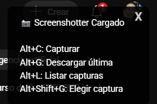

# Capturar Pantallas en YT Manualmente (Mejorado)

Un script avanzado para tomar capturas de pantalla de videos de YouTube con un sistema de gestión de múltiples capturas, notificaciones en pantalla y nombres de archivo inteligentes.

## ✨ Características

-   **Gestión de Múltiples Capturas:** Almacena hasta 5 capturas de pantalla en memoria antes de decidir cuál descargar.
-   **Nombres de Archivo Inteligentes:** Genera nombres de archivo automáticamente usando el título del video, el capítulo actual, el tiempo y la fecha (`Título_Capítulo_Tiempo_Fecha.webp`).
-   **Notificaciones en Pantalla:** Muestra notificaciones visuales para cada acción (captura, descarga, error, etc.) en lugar de usar la consola.
-   **Control por Teclado:** Maneja todo con atajos de teclado configurados.
-   **Calidad y Formato:** Guarda las imágenes en formato `.webp` para un balance óptimo entre calidad y peso.
-   **Previsualización y Elección:** Permite listar las capturas almacenadas y elegir específicamente cuál descargar.

## ⌨️ Atajos de Teclado

-   `Alt + C`: Toma una captura de pantalla del frame actual del video.
-   `Alt + G`: Descarga la captura más reciente.
-   `Alt + L`: Muestra una lista de las capturas almacenadas en memoria.
-   `Alt + Shift + G`: Permite elegir un número de la lista para descargar una captura específica.

## ⚙️ Instalación

1.  Asegúrate de tener instalada la extensión [Tampermonkey](https://www.tampermonkey.net/) en tu navegador.
2.  Haz clic en el siguiente enlace para instalar el script: **[Instalar Script](https://raw.githubusercontent.com/Deooz/tampermonkey-scripts/master/Capturar%20pantallas%20en%20YT%20manualmente%20(Mejorado)/Capturar%20pantallas%20en%20YT%20manualmente%20(Mejorado).user.js)**.
