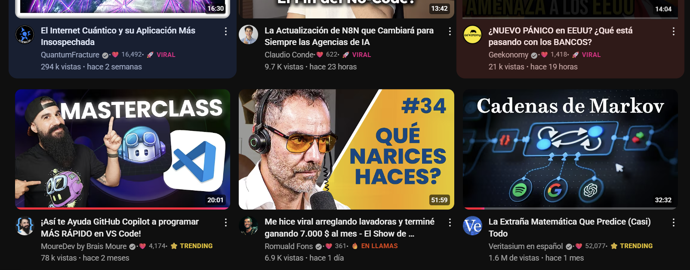

# YouTube Video Likes Before Click

Muestra el contador de "me gusta" y una puntuación de calidad para los videos de YouTube directamente en las miniaturas, antes de que necesites hacer clic.

## ✨ Características

-   **Likes Visibles:** Muestra el número de "me gusta" (❤️) en la información del video.
-   **Puntuación de Calidad:** Analiza los me gusta, las vistas y la antigüedad del video para asignar una etiqueta de calidad.
-   **Soporte Dinámico:** Funciona con los videos que se cargan al hacer scroll en la página principal, tendencias y suscripciones.
-   **Eficiente:** Realiza solicitudes a la API de YouTube en lotes para un rendimiento óptimo.

### Leyenda de Puntuación de Calidad

| Etiqueta        | Color                               | Significado                               |
| --------------- | ----------------------------------- | ----------------------------------------- |
| 🚀 **VIRAL**    | ■ | Crecimiento explosivo y altísimo engagement. |
| 🔥 **EN LLAMAS**  | ■ | Muy popular, con gran momentum.           |
| ⭐ **TRENDING**  | ■ | En tendencia, ganando popularidad.        |
| 📈 **CRECIENDO**  | ■ | Buen crecimiento y actividad constante.   |
| 👍 **ACTIVO**     | ■ | Actividad moderada y saludable.           |
| 😐 **LENTO**      | ■ | Poca actividad reciente.                  |
| 💤 **ESTANCADO**  | ■ | Actividad casi nula.                      |

## ⚙️ Instalación y Configuración

1.  Asegúrate de tener instalada la extensión [Tampermonkey](https://www.tampermonkey.net/) en tu navegador.
2.  Una vez que el script esté en GitHub, podrás instalarlo directamente desde un enlace que pondremos aquí.
3.  La primera vez que uses el script en YouTube, te pedirá que introduzcas tu **Clave de API de YouTube v3**. Puedes obtener una siguiendo [estas instrucciones](https://developers.google.com/youtube/v3/getting-started). El script guardará la clave de forma segura para futuras sesiones.

## 📜 Licencia

Este proyecto está bajo la Licencia MIT.
